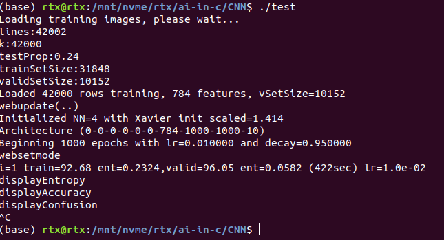

# Goals
Create a console version of the C++ CNN for MNIST.
Show image and results using ascii only.
Served as C/C++ programmer playing ground for CNN.
Expand the program to using multi-cores (CPU) and NVIDIA GPU (RTX3070)
Explore new ways for the CNN. (current model is slow and chunky. we should have smart ways to do it, like mask, sliding, etc..)

# First Run 2021.12.22
i=1 train=92.68 ent=0.2324,valid=96.05 ent=0.0582 (422sec) lr=1.0e-02 

# Ref
1. [MNIST-CNN-99.5] (https://github.com/cdeotte/MNIST-CNN-99.5) Very good and detailed implementation using C. 

